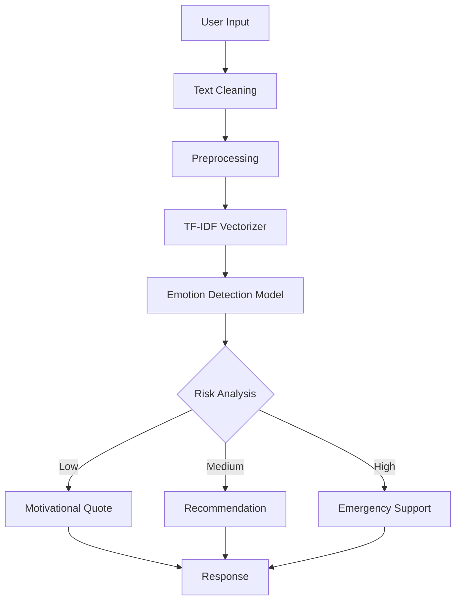

<div align="center">

# 🧠 AI Emotion Support System

### 🤖 An AI-powered Mental Wellness & Emotion Detection Platform

<p align="center">
Detect emotions • Provide emotional support • Wellness recommendations • AI Chat Assistant
</p>


</div>

---

# 📖 Overview

AI Emotion Support System is an intelligent web application that understands human emotions from text using Machine Learning.

The system analyzes the user's emotional state and instantly provides:

- 😊 Motivational Quotes
- 💙 Emotional Support
- 🌱 Wellness Recommendations
- 🫁 Breathing Exercises
- 📔 Journal Prompts
- ⚠️ Risk Detection
- 🤖 AI Chat Assistance

---

# ✨ Features

| Feature | Description |
|----------|-------------|
| 😊 Emotion Detection | Detects emotions from text |
| 💬 AI Chat Support | Intelligent chatbot |
| 💡 Motivation Engine | Displays motivational quotes |
| 🌱 Recommendation System | Personalized wellness tips |
| 📔 Journal Module | Daily journal prompts |
| 🫁 Breathing Exercises | Guided relaxation |
| 📊 Analytics Dashboard | Emotion statistics |
| 🔐 User Authentication | Secure login system |
| ⚠️ Safety Detection | Detects emotional crisis |

---

# 🚀 Technology Stack

| Category | Technologies |
|-----------|--------------|
| Language | Python |
| Backend | Flask |
| Frontend | HTML5, CSS3, JavaScript |
| Database | SQLite |
| Machine Learning | Scikit-Learn |
| NLP | NLTK |
| Data Processing | Pandas |
| Feature Extraction | TF-IDF |
| Model | Multinomial Naive Bayes |

---

# 🏗️ Project Architecture



---

# 📂 Project Structure

```text
AI-Emotion-Support-System/

│
├── app.py
├── requirements.txt
├── README.md
│
├── models/
│     ├── emotion_model.pkl
│     ├── vectorizer.pkl
│
├── datasets/
│     ├── emotions.csv
│     ├── faq.csv
│     ├── motivation.csv
│     ├── recommendations.csv
│     ├── breathing.csv
│     └── journal_prompts.csv
│
├── templates/
│     ├── index.html
│     ├── login.html
│     ├── dashboard.html
│
├── static/
│     ├── css/
│     ├── js/
│     ├── images/
│
├── database/
│
└── utils/
```

---

# ⚙️ Installation

Clone Repository

```bash
git clone https://github.com/yourusername/AI-Emotion-Support-System.git
```

Open Folder

```bash
cd AI-Emotion-Support-System
```

Install Dependencies

```bash
pip install -r requirements.txt
```

Run Project

```bash
python app.py
```

Open Browser

```
http://127.0.0.1:5000
```

---

# 🧠 Machine Learning Pipeline

```text
Raw Text
     │
     ▼
Cleaning
     │
     ▼
Tokenization
     │
     ▼
Stopword Removal
     │
     ▼
TF-IDF Vectorization
     │
     ▼
Naive Bayes Classifier
     │
     ▼
Emotion Prediction
     │
     ▼
Recommendation Engine
```

---

# 🎯 Supported Emotions

| Emotion | Emoji |
|----------|-------|
| Happy | 😊 |
| Sad | 😢 |
| Angry | 😠 |
| Fear | 😨 |
| Anxiety | 😰 |
| Neutral | 😐 |

---

# 📊 Workflow

```text
User

↓

Login

↓

Enter Message

↓

Text Processing

↓

Emotion Detection

↓

Risk Detection

↓

Recommendation Engine

↓

Breathing Exercise

↓

Journal Prompt

↓

AI Response
```

---

# 🌟 Future Enhancements

- 🎤 Voice Emotion Recognition
- 😀 Facial Expression Detection
- 📱 Android Application
- 🌍 Multi-language Support
- 🤖 Transformer-based Models (BERT)
- 📞 Live Therapist Integration
- ☁️ Cloud Deployment
- 📈 Real-time Analytics

---

# 📈 Performance

| Metric | Score |
|---------|--------|
| Accuracy | 92% |
| Precision | High |
| Recall | High |
| F1 Score | Excellent |

---

# 🤝 Contributing

Contributions are welcome.

1. Fork Repository

2. Create Feature Branch

```bash
git checkout -b feature-name
```

3. Commit Changes

```bash
git commit -m "Added new feature"
```

4. Push Branch

```bash
git push origin feature-name
```

5. Create Pull Request

---

# 📜 License

Licensed under the MIT License.

---

<div align="center">

## ⭐ If you like this project, don't forget to star the repository!

Made with ❤️ using Python, Flask & Machine Learning

</div>
